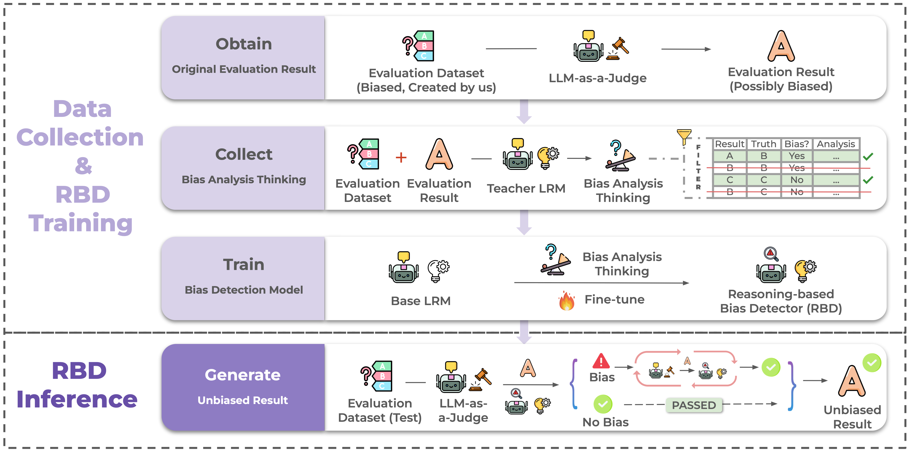

# Reasoning-Based Bias Detector (RBD)



## 🧠 Overview of the RBD

During inference, **RBD** examines potentially biased evaluation results produced by an LLM-as-a-Judge.  
If bias is detected, RBD generates a reasoning-based bias analysis to guide the LLM in reflecting on and possibly revising its evaluation; otherwise, the original judgment is retained.

To train RBD, we design a **data collection and distilled reasoning-based training pipeline**:

- We first construct a biased dataset that targets specific structural bias types (e.g., verbosity, position).
- Then, we collect evaluation results from LLM judges that may contain bias.
- A stronger teacher model, referred to as a **Language Reasoning Model (LRM)**, produces bias analysis traces based on the evaluation context.
- These reasoning traces are filtered and used to fine-tune a base LRM into the final RBD model.

The resulting RBD model can be plugged into any LLM evaluator to effectively detect and mitigate evaluation bias.


## 📊 Datasets

We release two datasets used in training and evaluation:

- 📂 data/RBD-Bias4-Eval — Contains structured evaluation examples labeled for bias.
- 📂 data/RBD-ReasoningSupervision — Provides reasoning annotations for supervised fine-tuning.


## 💻 Code Usage

Before running any scripts, navigate to the root code directory:

```bash
cd code
```

### 1. Construct datasets RBD-Bias4-Eval ($\mathcal{D}$ and $\mathcal{D}_{\text{bias}}$)

- Code for generating the unbiased and biased evaluation datasets is located in: `Scripts_Dataset_Construction`

### 2. Evaluate LLM Judgments on $\mathcal{D}$ and $\mathcal{D}_{\text{bias}}$

- Scripts for generating LLM answers under each bias type: `Scripts_LLM_Judge_Answer_Generation`


- Evaluation scripts comparing accuracy and consistency results on $\mathcal{D}$ vs. $\mathcal{D}_{\text{bias}}$ are located in: `Scripts_Evaluation/LLM-Judge_evaluation.py`

### 3. Construct Reasoning Supervision Dataset: RBD-ReasoningSupervision

- Code for generating reasoning-based supervision data: `Scripts_CoT_Generation`

### 4. Train RBD

We provide training scripts both with and without DeepSpeed:

🔹 Without DeepSpeed (for small models like RBD-1.5B):
```bash 
accelerate launch --num_processes 2 Scripts_Model_Train/train_full.py \
    --config Scripts_Model_Train/config_train_full.yaml \
    --experiment_tag CoT
```

- config: path to training config YAML file
- experiment_tag: QA for bias label training, or CoT for reasoning supervision

🔹 With DeepSpeed (for larger models):


```bash 
accelerate launch \
    --config_file Scripts_Model_Train/deepspeed_zero3.yaml \
    Scripts_Model_Train/deepspeed_train_full.py \
    --config Scripts_Model_Train/deepspeed_config_train_full.yaml \
    --experiment_tag CoT
```

- config_file: specifies the path to the DeepSpeed configuration file

To train a classification baseline model (without reasoning supervision):

```bash
accelerate launch --num_processes 2 Scripts_Model_Train/train_classification.py \
  --config Scripts_Model_Train/config_train_classification.yaml
```
- config: points to the YAML configuration file that defines the training setup for the classification model.

## 5. RBD Inference & Evaluation

- Run RBD inference on the test set: `bash Scripts_Model_Inference/testset_inference.sh
`

Core command:

```bash
python Scripts_Model_Inference/testset_inference.py \
  --model_path deepseek-ai/DeepSeek-R1-Distill-Qwen-14B \
  --base_model_name DeepSeek-R1-Distill-Qwen-14B \
  --dataset_name joyfine/LLM_Bias_Detection_CoT_Training \
  --experiment_tag Zero-shot \
  --output_method save-csv
```

- To evaluate the bias detection performance of RBD: `Scripts_Evaluation/model_train_evaluation.py`


## 6. Apply RBD Reasoning to LLM Evaluators
First, generate RBD reasoning traces for original LLM evaluations: `bash Scripts_Model_to_LLM_Judge_Inference/model_CoT_to_llm_judge_inference.sh`


Core command:
```bash
python Scripts_Model_to_LLM_Judge_Inference/model_CoT_to_llm_judge_inference.py \
  --model_path "$MODEL_PATH" \
  --csv_file_path "$CSV_PATH" \
  --LLM_evaluator "$MODEL" \
  --CoT_base_model "$BASE_MODEL" \
  --bias_type "$BIAS"
```

Then, LLM will rethink the evaluation results using RBD-generated reasoning: `bash Scripts_Model_to_LLM_Judge_Inference/LLM_judge_inference_with_CoT.sh`

Core command:

```bash
python Scripts_Model_to_LLM_Judge_Inference/LLM_judge_inference_with_CoT.py \
  --LLM_evaluator "$MODEL" \
  --csv_file_path "$CSV_PATH" \
  --CoT_base_model "$BASE_MODEL" \
  --experiment_tag "CoT" \
  --bias_type "$BIAS"
```

### 7. Evaluate Debiased LLM Judgments with RBD
- Run evaluation on debiased LLM judgments: `python Scripts_Evaluation/LLM-Judge_with_CoT_evaluation.py`


### 8. Additional Experiments
Explore RBD performance across various settings:

- Baselines: Compare with prompt-based and fine-tuned judge baselines

    `Scripts_Baselines`

- Cross-Domain: Test RBD's generalization on a verbosity dataset from the FactQA domain

    `Scripts_Cross_Domain`

- Multi-Bias: Evaluate RBD on multiple simultaneous biases (e.g., verbosity + bandwagon)

    `Scripts_Multi_Bias`

- QA vs. CoT: Compare classification models trained on bias labels vs. RBD trained on reasoning annotations using specially reconstructed datasets

    `Scripts_QA_vs_CoT`

- Recursive Inference: Use RBD recursively to refine reasoning and detection

    `Scripts_Recursive_Inference`

